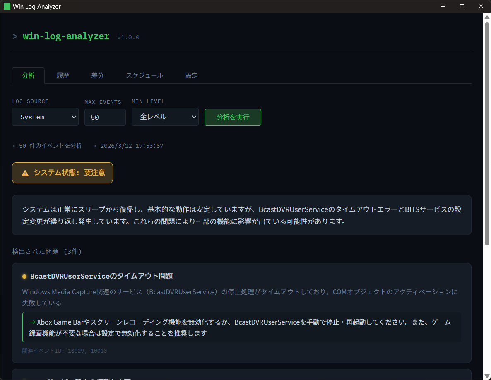

# win-log-analyzer

Windows のイベントログを Anthropic Claude API で分析するデスクトップアプリです。
タスクトレイに常駐し、手動実行・定期実行・差分レポートをサポートします。

## 背景・動機

Windows は頻繁にさまざまな原因で不具合が発生します。これまでは手動でイベントビューアーを開き、エラーをインターネットで検索したり、チャット型 AI にコピーして貼り付けたりして原因を調べていました。

しかしイベントログは複数のエラーが絡み合っていることが多く、単体のエラーコードで検索しても原因の特定には至らないことがほとんどです。結局、大量のログを手作業で AI に渡す非効率な作業になっていました。

このアプリは、その一連の作業を自動化します。難解なイベントビューアーを直接確認することなく、定期的にログを収集して AI がわかりやすく整理・分析することで、Windows の不具合原因の特定を容易にします。

**想定ユーザー：**
- Windows の不具合に悩む一般ユーザー
- イベントビューアーをそもそも知らない・使ったことがないユーザー
- 複数台の Windows を管理する IT 管理者

## スクリーンショット



## 機能

- **ログ分析** — PowerShell 経由で Windows Event Log を取得し、Claude API で要約・課題抽出・システム健全性を評価
- **履歴管理** — 分析結果を SQLite に保存し、過去の結果をいつでも参照
- **差分レポート** — 2 つのレポートを比較し、新規/継続/解消された課題を可視化
- **定期実行** — cron 式でスケジュールを登録し、バックグラウンドで自動分析
- **タスクトレイ常駐** — ×ボタンで閉じてもバックグラウンドで動作し続ける
- **APIキー管理** — キーを画面から入力して OS の資格情報ストア（DPAPI）で暗号化保存

## 動作環境

| 項目 | 要件 |
|------|------|
| OS | Windows 10 / 11 (x64) |
| PowerShell | 5.1 以上（Windows 標準搭載） |
| Anthropic API キー | [console.anthropic.com](https://console.anthropic.com) で取得 |

## インストール

`dist/packages/` に生成された以下のいずれかを使用してください。

- **`Win Log Analyzer Setup x.x.x.exe`** — NSIS インストーラー（スタートメニューに登録）
- **`Win Log Analyzer x.x.x.exe`** — ポータブル版（インストール不要）

初回起動後、タスクトレイアイコンをクリックしてウィンドウを開き、**設定タブ** から Anthropic API キーを登録してください。キー設定後にアプリを再起動すると分析が使えるようになります。

## 開発環境のセットアップ

### 前提

- Node.js v22 以上
- npm v10 以上
- **開発は Windows ネイティブ環境（PowerShell）で行う**
  （WSL2 は Electron の表示に WSLg が必要なため）

### 手順

```powershell
git clone https://github.com/TaikiKine/win-log-analyzer.git
cd win-log-analyzer
npm install
```

`server/.env` を作成して API キーを設定します（開発時のみ）。

```
ANTHROPIC_API_KEY=sk-ant-...
```

### 開発サーバーの起動

3 つのターミナルで以下をそれぞれ実行してください。

```powershell
# ターミナル 1: Hono API サーバー (port 3001)
npm run dev:server

# ターミナル 2: Vite dev server (port 5173)
npm run dev:client

# ターミナル 3: Electron
npm run dev:electron
```

## パッケージング

```powershell
npm run package:win
```

`dist/packages/` にインストーラーとポータブル版が生成されます。

### ビルドパイプライン

```
build:client   → Vite で React をビルド (client/dist/)
build:server   → esbuild で Hono サーバーを単一 CJS ファイルにバンドル (server/dist/)
build:electron → tsc で Electron メインプロセスをビルド (electron/dist/)
electron-builder → 上記を resources/ にまとめて exe を生成
```

## アーキテクチャ

```
win-log-analyzer/               # npm workspaces ルート
├── client/                     # React + Vite (フロントエンド)
│   └── src/
│       ├── App.tsx             # タブ UI（分析/履歴/差分/スケジュール/設定）
│       ├── api.ts              # API_BASE（file:// 対応）
│       └── ...
├── server/                     # Hono API サーバー (port 3001)
│   └── src/
│       ├── index.ts            # エンドポイント定義
│       ├── fetch-logs.ts       # PowerShell 経由でイベントログ取得
│       ├── analyze.ts          # Claude API 呼び出し
│       ├── db.ts               # node:sqlite 初期化
│       ├── repository.ts       # SQLite CRUD
│       ├── scheduler.ts        # node-cron 定期実行
│       └── diff.ts             # 差分計算
└── electron/                   # Electron メインプロセス
    └── src/
        ├── main.ts             # ウィンドウ管理・IPC ハンドラ
        ├── tray.ts             # タスクトレイ
        ├── server-process.ts   # Hono サーバーを子プロセスとして管理
        ├── window-state.ts     # ウィンドウ位置の永続化・API キー暗号化
        └── preload.ts          # contextBridge (IPC ブリッジ)
```

### 技術的な選択

| 選択 | 理由 |
|------|------|
| Electron — CommonJS | `electron-store` v8 (CJS) との互換性、Electron API との親和性 |
| サーバー — ESM | Hono・tsx のモダン標準に合わせる |
| `node:sqlite`（組み込み） | ネイティブモジュールのリビルドが不要、Electron の V8 バージョン問題を回避 |
| esbuild でサーバーをバンドル | npm workspaces のホイスト問題（hono 等が root に配置される）を解消 |
| `safeStorage` + `electron-store` | Windows DPAPI による OS レベルの暗号化、追加依存なし |
| Vite `base: "./"` | `file://` プロトコルでアセットパスを相対解決するため |

## APIキーの保存場所

設定画面で登録した API キーは以下に暗号化されて保存されます。

```
C:\Users\<ユーザー名>\AppData\Roaming\Win Log Analyzer\config.json
```

値は Windows DPAPI で暗号化されており、同一ユーザー・同一 PC 以外では復号できません。

## ライセンス

MIT
